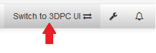

# OctoPrint-3DPC-UI

3DPC Project - User Interface Plugin for OctoPrint

- 3DPC Project : [https://herve-perchec.fr/projects/3dpc](https://herve-perchec.fr/projects/3dpc)
- OctoPrint : [https://github.com/foosel/OctoPrint](https://github.com/foosel/OctoPrint)

This plugin adds a button in the navbar of the octoprint default interface that enables you to switch to the totally independant 3DPC User Interface.



## Setup

Install via the bundled [Plugin Manager](https://github.com/foosel/OctoPrint/wiki/Plugin:-Plugin-Manager)
or manually using this URL:

    https://github.com/herveperchec/OctoPrint-3DPC-UI/archive/master.zip


## Configuration

**TODO:** 

## Development

Supposing OctoPrint is running (or run it with the command 'octoprint serve')

```bash
cd octoprint_threedpc_ui
npm run dev
```

## Build

```bash
cd octoprint_threedpc_ui
npm run build
```